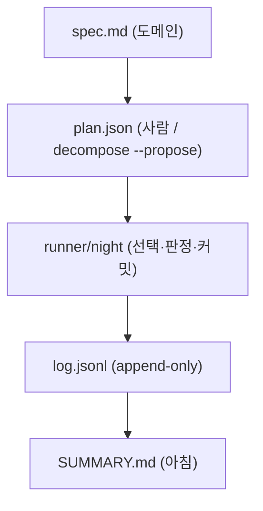

# diagram — 그림이 먼저, 산문은 뒤에

구성 요소가 셋 이상 엮인 설명(모듈 관계, 호출 순서, 상태 전이, 데이터 모델)은 산문으로 읽히지 않는다. mermaid 블록 하나를 먼저 내고, 산문은 그림이 못 담는 것(왜, 예외, 수치)만 덧붙인다.

## 규칙 4개

1. **형식은 내용이 정한다.**
   - 관계·의존·구성 → `flowchart` (방향은 `TD`가 기본, 파이프라인은 `LR`)
   - 시간 순서·호출·메시지 → `sequenceDiagram`
   - 상태와 전이 → `stateDiagram-v2`
   - 데이터 모델·테이블 관계 → `erDiagram`
2. **노드 12개를 넘으면 쪼갠다.** 하나에 다 넣지 않는다 — 층(layer)이나 단계(phase)마다 그림 하나. 쪼갠 그림 사이의 연결은 첫 그림에 상위 노드로만 표시한다.
3. **다이어그램은 주장이다.** 코드·로그·설정에서 확인한 사실만 그린다. 바라는 구조, 추측한 호출, "아마 이럴 것"은 그리지 않는다 — 확인 못 한 것은 노드 라벨에 `?`를 붙이고 산문에서 밝힌다.
4. **렌더 대상은 Obsidian·GitHub**(mermaid 네이티브). 이미지 파일·외부 렌더 서비스를 만들지 않는다. 라벨에 `[ ] { } ( ) < > | " #` 같은 파서 특수문자를 넣지 않는다 (필요하면 따옴표 라벨 `A["텍스트"]`).

## 형태

그림 뒤 산문은 세 줄 안쪽: 무엇을 그렸나 · 그림이 못 담은 조건 · 확인하지 못한 곳.

## 쓰지 않는 경우

- 요소가 둘뿐이거나 관계가 한 줄로 끝날 때 — 산문 한 문장이 더 빠르다.
- 사용자가 "코드로", "표로"라고 형식을 정했을 때.
